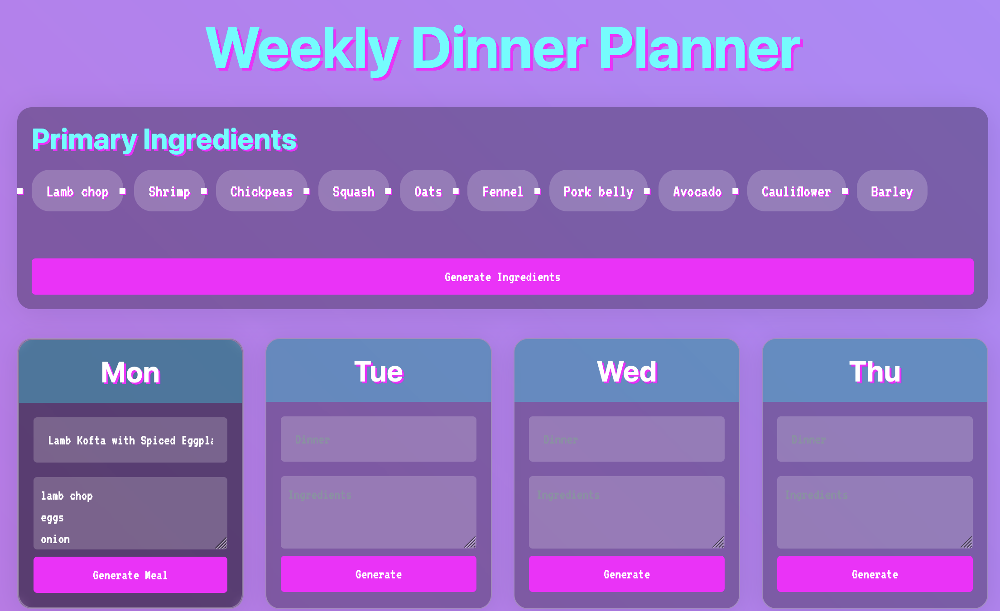

# Weekly Meal Planner

A vaporwave-styled web application for planning your weekly meals and generating organized shopping lists.



## Features

- Generate meal suggestions based on ingredients you have
- Drag-and-drop ingredient selection
- Automatic shopping list generation
- Export shopping lists to CSV with quantities
- Cultural consistency in meal suggestions
- Vaporwave aesthetic interface

## Requirements

- Python 3.10+
- Ollama (running locally)

## Installation - UV based

1. Clone the repository
2. Install dependencies:
```bash
uv sync
```
